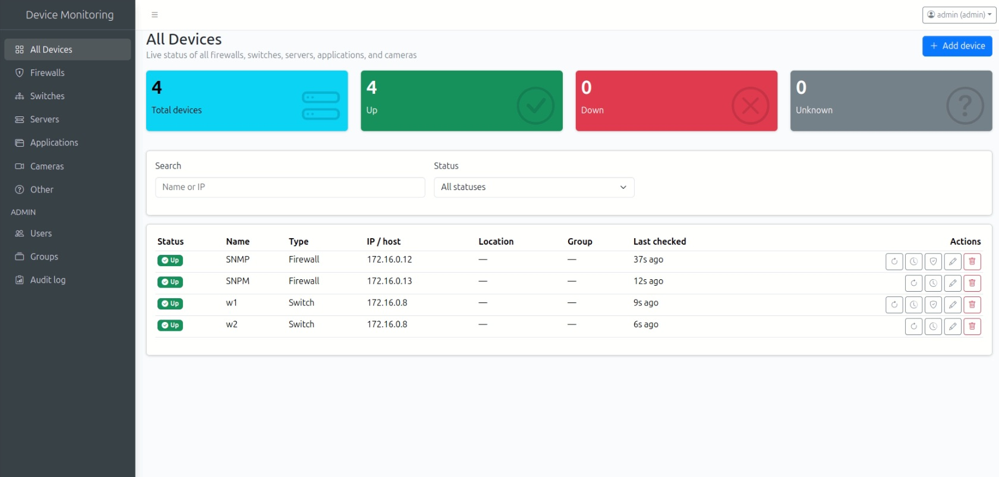

# Device Monitoring Dashboard

**One dashboard for every firewall, switch, server, application, and camera on your network** — live status, real health telemetry, and instant alerts, without per-vendor scripts or agents to install.



## Why teams use this

- **See everything, in real time.** Every device's up/down status updates live over WebSockets — no refresh button, no stale dashboards. Summary tiles show total/up/down/unknown at a glance, filterable by type, status, or site group.
- **Works with the hardware you already have.** Auto-detects chassis model, serial number, firmware version, and environmental health (fans, power supplies, temperature) from any vendor speaking standard SNMP/ENTITY-MIB — Cisco, Juniper, Arista, HP, Dell, and more. No vendor-specific onboarding required.
- **Deeper than a ping.** A native FortiGate connector reports HA status, license expiry, and live resource usage; every other firewall/switch gets a generic SNMP fallback with CPU/memory, PoE budget, uplink health, and interface bandwidth (real Mbps, not just link speed).
- **Real bandwidth, not link speed.** Per-interface and per-device Rx/Tx throughput computed from 64-bit counters — accurate even on multi-gigabit trunks.
- **Alerts where your team already works.** Slack or Microsoft Teams webhook notifications the moment a device goes down, and again on recovery — with per-device mute for planned maintenance.
- **Access control built in.** Role-based accounts (admin / operator) with per-group visibility, so a regional team only sees their own sites — plus a full audit trail of every change, for admins.
- **Six ways to check, per device.** Ping, TCP, HTTP(S), SNMP, SSH login verification, ONVIF (for cameras), or a full vendor-aware auto-detect connector — pick whichever fits each device.

## What it monitors

| Device type | Check methods | Health detail |
| --- | --- | --- |
| Firewalls | Ping, TCP, HTTP(S), SNMP, SSH, **Auto-detect vendor** | Native FortiGate API (HA, license, resources) or generic SNMP (CPU/memory, interfaces, bandwidth, environment) |
| Switches | Ping, TCP, HTTP(S), SNMP, SSH, **Auto-detect vendor** | Generic SNMP — uplinks/ports, PoE budget, interface bandwidth, environment |
| Servers, Applications, Cameras, Other | Ping, TCP, HTTP(S), SNMP, SSH, ONVIF (cameras) | Reachability + auto-discovered chassis/interface info over SNMP |

Every device gets status history with 24h/7d/30d uptime %, a live timeline, and a transparent "what is actually being checked right now" panel.

## Quick start (Docker, one command)

The fastest way to see it running with a working demo dataset — 3 sample sites, sample devices, and 5 accounts covering every access-control case:

```bash
git clone <this-repo-url>
cd monitoring-dashboard
./start.sh
```

That's it — the script starts MongoDB, seeds an admin account and the demo dataset, and brings up the full stack.

```
Client:  http://localhost:5173
Server:  http://localhost:4000

Admin login:   admin / ChangeMe123!
Demo accounts: demo-admin / op-hq / op-east / op-west / op-all  (password: demo-password-123)
```

Override the admin credentials in one line: `ADMIN_USERNAME=myadmin ADMIN_PASSWORD='S0meLongPassw0rd!' ./start.sh`

Already have the stack running and just pulled new code? Use `./rerun.sh` instead — rebuilds and restarts without touching your existing MongoDB data.

## Manual / development setup

```
server/   Node.js/Express API + MongoDB + the monitoring scheduler
client/   React (Vite) dashboard
```

**Backend**

```bash
cd server
cp .env.example .env      # set MONGODB_URI and a real JWT_SECRET
npm install
npm run seed:admin -- admin your-password-here   # creates the first admin account
npm run dev                # http://localhost:4000
```

**Frontend**

```bash
cd client
cp .env.example .env       # point VITE_API_BASE_URL at the backend
npm install
npm run dev                 # http://localhost:5173
```

**Tests**

```bash
cd server
npm test                    # unit tests — checks, health engines, auth, alerts, SNMP parsing...
node smoke-test.js          # full end-to-end smoke test against a real in-memory MongoDB
```

## Tech stack

Node.js / Express / MongoDB (Mongoose) on the backend, React (Vite) with AdminLTE 4 on the frontend, Socket.IO for live updates, `net-snmp` for SNMP v1/v2c/v3, `ssh2` for SSH login verification. Plain JavaScript throughout — no TypeScript, no build-step surprises.

## Documentation

The full engineering changelog — every phase of what was built, the design decisions behind it, and known limitations — lives in [CHANGELOG.md](CHANGELOG.md).
